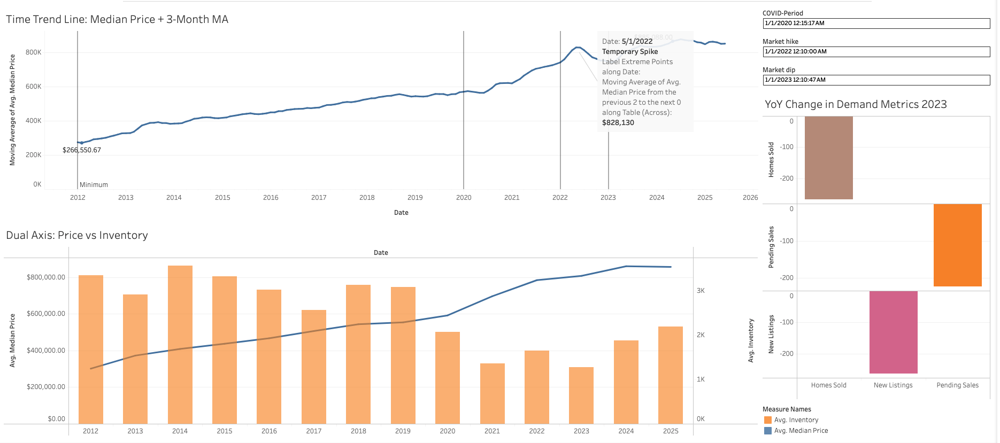

# San Diego Housing Market Analysis
**Supply, Demand, and Price Dynamics (2012–2025)**
 
---
 
## Overview
This project analyzes housing market dynamics in San Diego using Redfin data, focusing on the relationship between **inventory (supply), transaction activity (demand), and pricing behavior**.
 
The goal was not just to visualize trends, but to identify **what actually drives price movement**, how market conditions shifted during and after COVID, and whether inventory can be used as a forward-looking price signal.
 
---
 
## Key Questions
- What drove the rapid price acceleration from 2020 to 2022?
- How strongly does inventory influence price behavior?
- Did demand meaningfully contract in 2023?
- Does inventory act as a leading indicator of future prices — and across what horizon?
---
 
## Dataset
- **Source**: Redfin Data Center
- **Scope**: San Diego Metro Area
- **Time Range**: 2012 – 2025
- **Granularity**: Monthly
- **Records**: 1,458 observations
### Core Features
- Median Sale Price
- Inventory
- Homes Sold
- Pending Sales
- New Listings
- Days on Market
- Sale-to-List Ratio
---
 
## Tools & Stack
- **Python (Pandas, Seaborn, Matplotlib, Scikit-learn, SciPy)** → EDA, feature engineering, regression
- **SQL (PostgreSQL)** → Data storage & querying
- **Tableau** → Business-facing visualization
- **GitHub** → Version control & documentation
---
 
## Methodology
 
### 1. Data Processing
- Filtered to the San Diego metro region
- Aggregated to monthly averages
- Engineered features:
  - 3-month rolling averages
  - MoM and YoY % changes
  - Lagged inventory-to-price relationships (lags 1–12 months)
### 2. Exploratory Analysis
- Time-series trend analysis (price, inventory, sales)
- Rolling average smoothing
- Demand contraction analysis (2023)
- Full Pearson correlation matrix across all metrics
### 3. Leading Indicator Analysis *(extension)*
- Lag correlation loop: inventory[t] vs median price[t + lag] across all 12 forward horizons
- Scatter analysis colored by market era (pre-COVID / COVID surge / post-surge)
- OLS regression: inventory[t] → price[t+12]
- Residual diagnostics to test model stability across regimes
### 4. Visualization
- Tableau dashboard: price trend, price vs inventory, YoY demand shifts
- Python: lag correlation bar chart, era-colored scatter, OLS residual plots
---
 
## Key Insights
 
### 1. Price Acceleration Was Supply-Driven
- Median price increased ~45.8% (Apr 2020 → May 2022)
- Inventory fell ~34% over the same period
**Interpretation:**
Price growth aligned directly with supply contraction. The steepest appreciation
occurred precisely when inventory hit its lowest recorded levels.
 
---
 
### 2. 2023 Marked a Clear Demand Reset
- Homes Sold: −22.3% YoY
- Pending Sales: −18.5% YoY
- New Listings: −21.9% YoY
**Interpretation:**
Demand contraction was broad — not isolated to one metric — likely driven by
affordability constraints and rising mortgage rates. The sharpest reset since 2020.
 
---
 
### 3. Inventory is the Dominant Contemporaneous Price Driver
- Pearson correlation with median price: r = −0.79
- Pending sales: r = −0.74 | New listings: r = −0.62
**Interpretation:**
Supply constraints are the primary lever in this market.
Transaction volume reflects market conditions — it does not drive them.
 
---
 
### 4. Inventory as a Structural Price Condition *(extension finding)*
 
A lag correlation analysis across all 12 forward horizons reveals that inventory
carries a strong, stable inverse signal with future prices (r = −0.80 to −0.86).
Crucially, signal strength does not decay with time — it is nearly flat from
lag 1 through lag 12.
 
**This flatness is the finding.** Inventory is not a short-term timing trigger.
It is a durable market condition: low supply predicts elevated prices across the
entire forward window, not just the next quarter.
 
OLS regression on the 12-month lag quantifies the relationship:
 
| Metric | Value |
|---|---|
| Coefficient | −$167 per inventory unit |
| Intercept | $1,027,277 |
| R² | 0.741 |
| p-value | 3.18e−45 |
 
**Plain-English signal:** each 100-unit drop in inventory is associated with
approximately $16,700 higher median prices 12 months later.
 
**Residual diagnostics** confirm era-dependent bias — the model systematically
underpredicts post-2020 prices, reflecting a structural price floor shift that
inventory alone cannot explain. Inventory should be treated as a reliable
directional indicator, not a precise price forecast. Intercept assumptions
require recalibration when applied to post-2022 data.
 
**Actionable threshold:** when San Diego inventory falls below ~1,500 units,
historical precedent and this model suggest median prices will remain at or
above $800K across the following 12 months. Current inventory (Jun 2025:
~1,526 units) sits at that threshold.
 
---

## Tableau Dashboard
🔗 *(https://public.tableau.com/app/profile/alberto.beltran.de.la.torre/viz/Book1_17557936058330/Dashboard1)*  

### Views Included
- Median Price + 3-Month Moving Average  
- Price vs Inventory (dual axis)  
- YoY Demand Changes (2023)  

---
 
## Repository Structure
```
sd-housing-trends/
├── data/
│   ├── raw/
│   └── processed/
├── notebooks/
│   └── sd_housing_market_dynamics_analysis.ipynb
├── visuals/
│   ├── lag_correlation_chart.png
│   ├── scatter_inventory_vs_future_price.png
│   └── ols_residuals.png
├── sql/
├── tableau/
└── README.md
```
 
---
 
## What This Project Demonstrates
- Time-series analysis & feature engineering
- Correlation and lag analysis across multiple forward horizons
- OLS regression with residual diagnostics
- Regime-aware interpretation (pre/post structural break)
- Translating statistical findings into actionable, plain-English signals
- Communicating honestly about model limitations
---
 
## Next Steps
- Integrate Zillow Home Value Index for cross-source validation
- Detrend the inventory and price series to isolate the lag signal from long-run trend
- Build a short-term price forecasting model incorporating multiple leading indicators
- Automate monthly market updates

---
